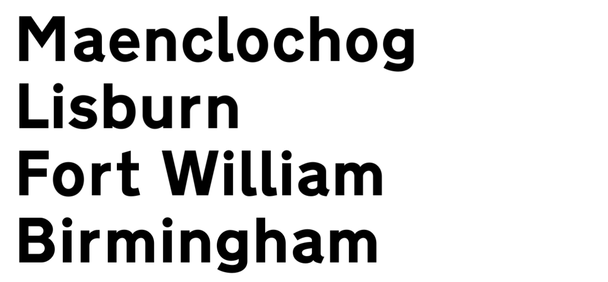
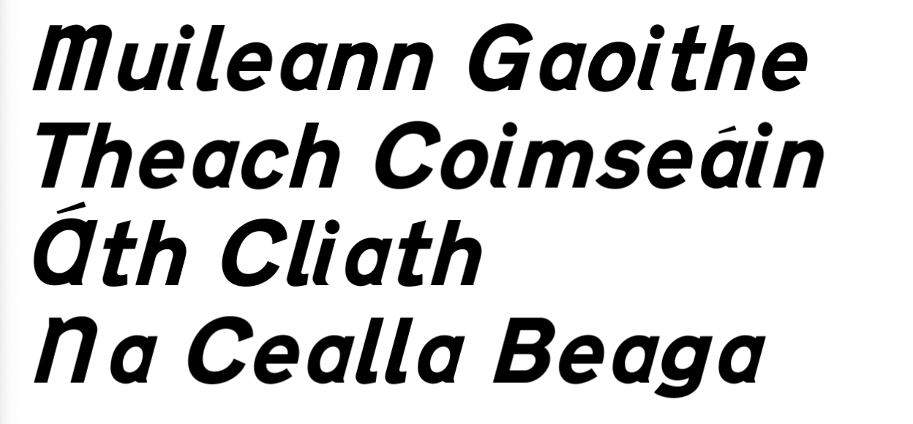
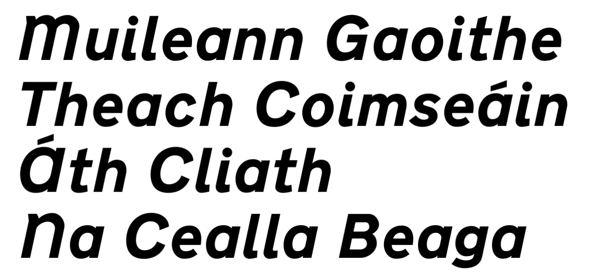

# uk-ire-road-sign-fonts

## About this repository

This repository contains a recreation of some of the fonts used on road signs in the UK and Ireland.

## How to use the fonts

TrueType (`.ttf`) and OpenType (`.otf`) versions of the fonts are included in the `build` folder. Simply install either version on your computer and start using them!

UFO and FontLab 8 formats are also supplied if you fancy working on the sources in your font editor of choice.

If you have Python 3.11 then feel free to build the fonts from source using the script provided.

## What fonts are currently included?

### Transport Heavy

Transport Heavy is the typeface used on road signs in the UK, specifically for rendering black text on a white background. The specification of the alphabet can be found in the [working drawings](https://www.gov.uk/government/publications/traffic-signs-working-drawings-tsrgd-2016-schedule-17) on the UK Government website. The font in this repository, AG Transport Heavy, is based on these working drawings.

I've gone for fidelity over consistency so curves have been fitted as closely as possible to the original and the spacing matches that of the drawings.

I have made no attempt to create new glyphs beyond those that exist in the original drawings. This implementation is not for you if you're hoping to use this font for long runs of text in a range of weights for use in print or on the web. If, however, you want an accurate representation of Transport Heavy because you want to recreate your own road signs for graphic design purposes then this will absolutely do a brilliant job for you. Please also review the [government guidance](https://www.gov.uk/guidance/traffic-sign-images) to see if this is the right font for you.

### EI-TP Heavy

The EI-TP font is a version of Transport Heavy used to render Irish language text on road signs in Ireland. The glyphs in EI-TP are Transport Heavy glyphs that have been mechanically italicised by 15 degrees, although custom glyphs have been drawn for `A`, `M`, `N` and `i`.

The specification of the alphabet can be found in Chapter 2 of the Irish Goverment's [Traffic Signs Manual](https://www.trafficsigns.ie/tsm-cur)

AG EI-TP is directly based on AG Transport Heavy with new drawings based roughly on the Traffic Signs Manual specification. Some of those new glyphs are quite poorly drawn from a type design perspective so I have smoothed some of the curves in the upper case `A` and lower case `a`. Those new glyphs have some dubious spacing too, so I have kept a flavour of that in place.

### EI-TP New Heavy

EI-TP New Heavy is an attempt by me to address some of the obvious quirks of EI-TP Heavy that frequently annoy me whenever I drive in Ireland with my type nerd senses on full alert.

EI-TP New Heavy improves on EI-TP Heavy in the following ways:

- The italic is now at a less harsh 12 degrees instead of 15 degrees.
- Slanting glyphs mechanically causes issues with stroke width; curves can appear to bulge in some places, while appearing narrower in others. In EI-TP New Heavy, curve compensation has been applied to preserve a consistent stroke width
- Spacing is now consistent - there should be no weird gaps between glyphs
- A proper tail has been added to the `i` to make it consistent with the `l`
- The `A` has been redrawn and is wider to make it match the characteristics of similar glyphs like `C`
- The `a` has been redrawn and is wider to make it match the characteristics of similar glyphs like `d`
- The `M` and `N` have been redrawn and are wider

## What fonts are not included?

- Transport Medium: a lighter weight of Transport Heavy, used in the UK to render lighter coloured text on darker backgrounds
- Motorway Permanent and Temporary - a smaller alphabet used to render route numbers on motorway signage

I might get round to some of the above at some point. But then again I might not.

## License

The working drawings of Transport Heavy are Crown Copyright available under the Open Government Licence.

The fonts in this repository are derived from those drawings.
